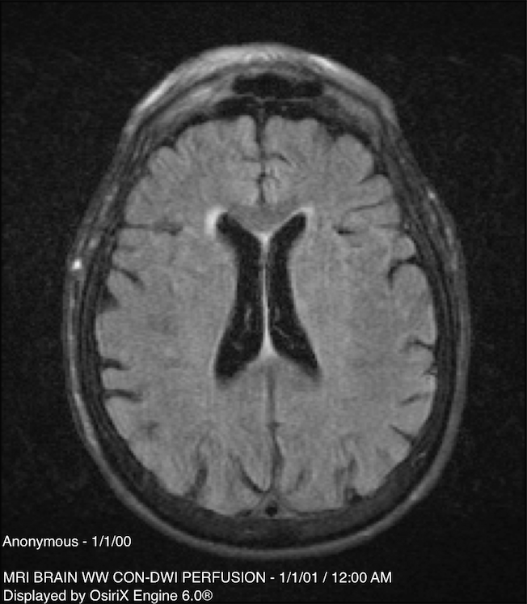
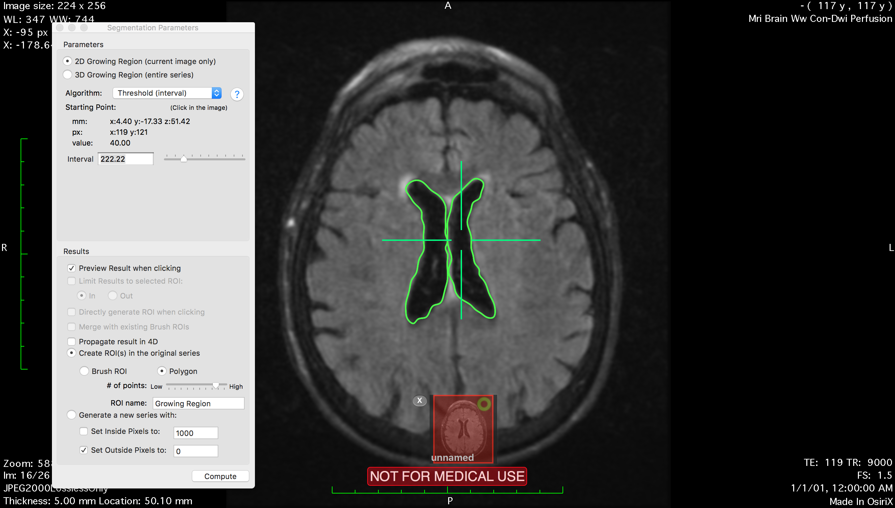

# Creating the ground truth bitmasks with OsiriX

Our next step after gathering the data was to create the ground truth bitmasks that we could use to
train our machine learning model. We found OsiriX to be the most convenient program to do this task. Our
plan was to use the software to manually mark all parts of the brain with a high value, and the rest of the
image with a value of zero.

## Filtering the data

We acquired a lot of data from our previous meeting with Professor Scalzo, and not all of them would be
good for training our model. In particular, some images were not actually FLAIR images, so we couldn't
use those. In addition, many more were either very tilted, did not have much of the brain in them, 
or were of bad quality. We ended up filtering the data to around twenty five images that we thought were
good for training our model. 

Here is an example of one of the images we selected:

## Selecting the ROIs

Now, we used the OsiriX in order to select regions in the brain to generate the bitmask. We first selected
the ventricles in the middle of the brain. Using the ROI selector in OsiriX, we played around with the 
algorithm and parameters until the growing ROI region best fit the ventricles:

After selecting those ROIs, we set all pixel values inside them to zero.

Next step was to remove the skull and everything outside the brain. We again used the ROI selector and
played around with the parameters until we could accurately select the brain. Then, we set all pixel
values outside the ROI to zero:

 
Finally, we selected the rest of the brain using the brush method and the threshold lower/upper bounds 
algorithm, and set all pixels inside it to 1000. This resulted in our final bitmask:

We did these steps for all of the FLAIR images we selected. After finishing processing all of the images, 
we exported the bitmasks as DICOM files to be used as the ground truths later when training our model.

 

