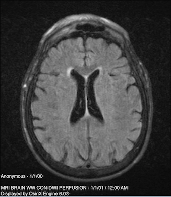

# Acquiring the FLAIR data (5/2/17)

In order to be able to train a machine learning model, we needed a training set of images
and their ground truths bitmasks. The first step would be to acquire brain and skull images
taken previously that we could use in our model. We decided on using FLAIR images, which is
a pulse sequence used in MRI that stands for "fluid-attenuated inversion recovery." It nulls
signals from the cerebrospinal fluid (CSF), so it is commonly used for brain imaging.

Through email correspondence, we set up a meeting with Professor Scalzo and Yannan Yu
in Suite 116 of the Neuroscience Research Building to acquire the image data.

### Anonymizing the data

To protect the privacy of the patients whose brain images we would be using, we first had
to find a way to anonymize the data. In particular, the names and addresses needed to be
removed from DICOM files before transferring them to us. We managed to find a DICOM 
Anonymizer software that was able to do this task in a batch quickly.

### Transferring the images

Here is a sample of what the FLAIR images we selected looked like:

The next step was transferring some of the images to us so we can use them in training our model. At
first we looked through all the folders containing the images, and selected the FLAIR images one at
a time to be copied. This was taking too long, so we instead wrote a script that could automatically
transfer all FLAIR images to the external directory. We then bundled all the images we needed together
and Professor Scalzo uploaded and emailed them to us.

