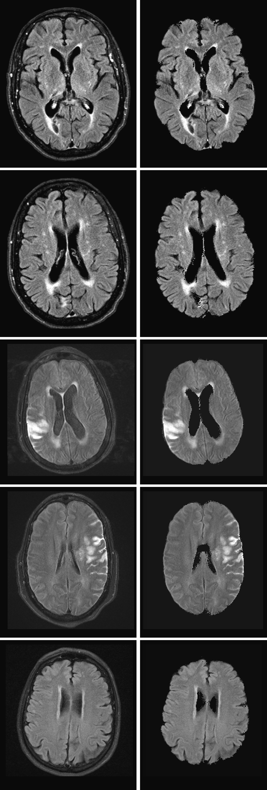

# Improving the results

The results we attained were very promising. We achieved a mean Dice score of 95.75, however, we wanted to see if we could improve our results further. To do this we considered two postprocessing options. Overall, we found the two-phased approach gave us the best results.

## Neighbor Analysis
The first approach we tried was neighbor analysis. We looped through each pixel in the image and if more than 84% (tested out different values) of the pixels in the 5x5 grid around it were of a specific type (0 or 1), we changed its type to match the majority. This allowed us to fill in small holes in the image. We also tried doing multiple passes of this but that resulted in too many false positives. This approach yielded a mean Dice score of 95.87.

```python
##
# Possible postprocessor for image
#
# image_data: [2D array] Image which needs to be post processed
#
# Note: Not being used. Results subpar.
##
def neighbor_postprocess(image_data):
	# Compute dimensions of the image
	height = len(image_data)
	width = len(image_data[0])

	neighbor_grid = 2
	grid_size = (2*neighbor_grid + 1) * (2*neighbor_grid + 1)
	threshold = grid_size * 21/25

	# Iterate through each row of pixels (excluding MARGINs)
	for y in range (neighbor_grid, height - neighbor_grid):
		for x in range (neighbor_grid, width - neighbor_grid):
			neighbor_count = 0
			for pix_x in range (x - neighbor_grid, x + neighbor_grid + 1):
				for pix_y in range (y - neighbor_grid, y + neighbor_grid + 1):
					if image_data[pix_y, pix_x] != 0:
						neighbor_count += 1

			if image_data[y, x] == 0:
				if neighbor_count > threshold:
					image_data[y, x] = 1000
			else:
				if grid_size-neighbor_count > threshold:
					image_data[y, x] = 0

	return image_data
```
## Two-Phased Approach 
The second approach was to have two-phases. In the first phase, we do the same thing as our original approach and train the algorithm normally. This allows the program to create the skull stripping bit masks from MRIs. In the second phase we use a different training set to generate bit masks using the learning from phase 1 and then train the same algorithm to take these bit masks and make them more like the ground truth. This two phased approach gave us a better results with a mean Dice score of 97.02. Using both approaches resulted in a mean Dice score of 97.01.

```shell
function train {	
	echo ">>> Training"
	echo "Phase 1 - Training to create new bitmaps"
	python3 skullstrip.py -t ./data/train_phase1/ -c phase1.pkl
	echo "Phase 1 - Creating new bitmaps using learned technique"
	python3 skullstrip.py -p -b -i ./data/train_phase2/ -r ./data/phase1temp/ -c phase1.pkl
	echo "Phase 2 - Learning from mistakes"
	cp ./data/train_phase2/BM* ./data/phase1temp/
	python3 skullstrip.py -t ./data/phase1temp/ -c phase2.pkl

}

function process {
	echo ">>> Processing"
	echo "Phase 1 - Creating bitmaps"
	python3 skullstrip.py -p -b -i ./data/test/ -r ./data/phase1result/ -c phase1.pkl
	echo "Phase 2 - Fixing bitmaps"
	python3 skullstrip.py -p -b -i ./data/phase1result/ -r ./data/phase2result/ -c phase2.pkl
	echo "Applying generated masks to original images"
	python3 skullstrip.py -m ./data/test/ ./data/phase2result/ ./data/result/
}
```
# Final Results
<div style="text-align:center"></div>
